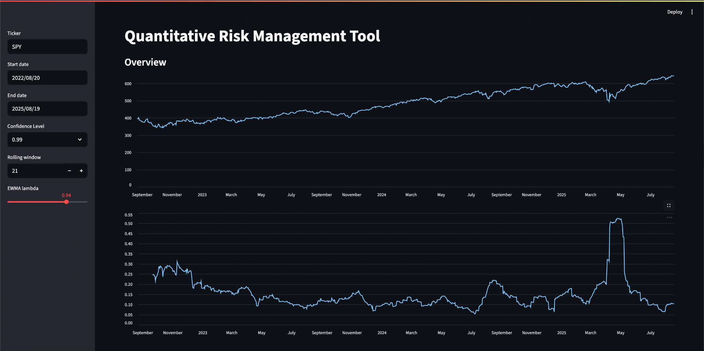

# 📊 Quantitative Risk Management Tool

An educational **risk analytics dashboard** built with Python + Streamlit.  
It allows users to explore **financial risk metrics** (VaR, CVaR, volatility, drawdowns) on any stock or ETF.

---

## 🚀 Features
- **Price Data Fetching:** Live data via [yFinance](https://pypi.org/project/yfinance/) with local caching for reproducibility.
- **Returns & Volatility:**
  - Log returns
  - Rolling annualized volatility
  - EWMA volatility (RiskMetrics λ = 0.94 default)
- **Risk Metrics:**
  - Historical VaR (quantile-based)
  - Conditional VaR (Expected Shortfall)
  - Parametric VaR (Normal distribution)
- **Drawdown Analysis:** Visualize maximum losses from peak values.
- **Interactive Dashboard:** Streamlit app with sidebar controls for ticker, date range, confidence level, and EWMA λ.

---

## 🖥️ Demo Screenshot


---

## ⚙️ Tech Stack
- **Python:** Data analysis & modeling
- **Pandas / NumPy / SciPy:** Time-series stats
- **Streamlit:** Interactive web app
- **yFinance:** Market data API

---

## 📂 Project Structure
src/
config.py # App configuration
data.py # Data fetching + caching
returns.py # Returns & volatility calculations
var.py # VaR & CVaR implementations
app.py # Streamlit dashboard
tests/ # Unit tests

---

## ▶️ How to Run
```bash
git clone https://github.com/<your-username>/quant-risk-tool.git
cd quant-risk-tool
python -m venv .venv && source .venv/bin/activate
pip install -r requirements.txt
streamlit run src/app.py